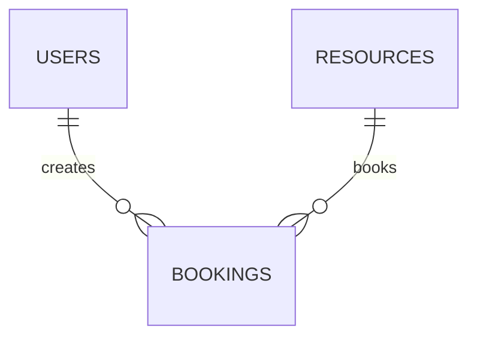

# URMS Database Schema - Sprint 2 Complete
## Tables (3 total):
- users (5 fields)
- resources (8 fields) 
- **bookings (9 fields)**

## Relationships:
- users 1:N bookings
- resources 1:N bookings

## Updated ERD


## Indexes (NEW):
- bookings.booking_date
- bookings.userid  
- bookings.resourceid
- UNIQUE(userid, resourceid, booking_date, start_time)

## Migration Notes:
- Added bookings table to existing schema
- Foreign keys prevent orphan records
- Unique constraint prevents double bookings

## Execution Instructions
1. Ensure MySQL is running on `localhost:3306`.
2. Apply the schema using the command line:
   ```bash
   mysql -u root -p < output/database/schema.sql
   ```
   *Note: This script will create the `urms_dev` database and all tables/indexes.*
